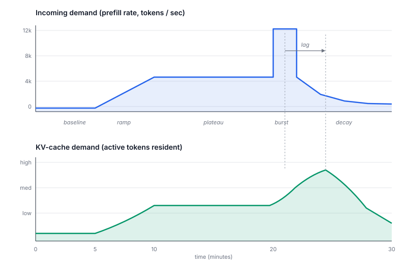
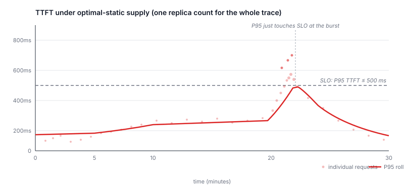
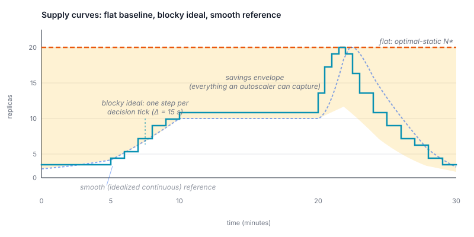
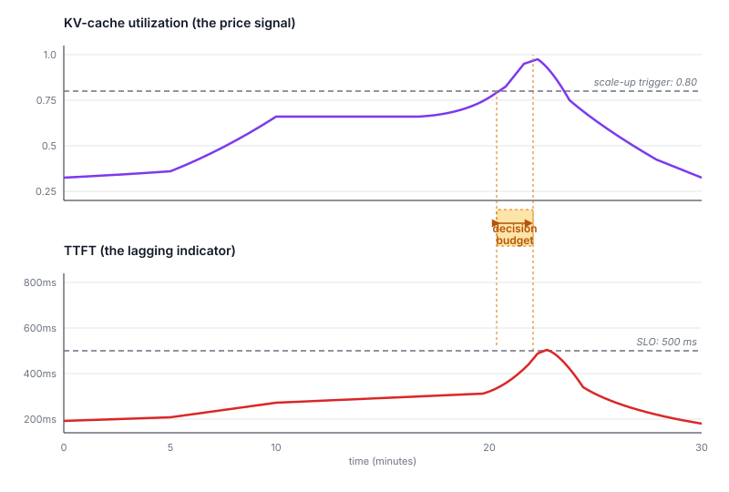

# Evaluating an LLM Autoscaling Strategy: Fundamentals

> *Draft.* Audience: ML-systems researchers and contributors to this project.

How do you tell whether an autoscaler for an LLM serving stack is any good? "It scales up when load goes up" is necessary but useless as a benchmark — it doesn't tell you how much you're paying for that elasticity, or how close to the achievable lower bound your strategy lands.

The most intuitive frame is **supply and demand**. Workload generates demand for KV-cache room. Replicas supply it. An SLO breaks when demand outruns supply for too long. Cost is what you pay for that supply over time. An autoscaler is a control law that nudges supply up and down in response to changing demand. Every evaluation question — "is this autoscaler good?" — turns into a question about how well its supply curve tracks demand.

We'll keep things narrow on purpose: one SLO (**time-to-first-token**, TTFT) and one supply commodity (**KV-cache slots**). Real evaluations need more — TPOT, end-to-end latency, multiple GPU classes — but the framework generalizes; the simpler version is the right one to internalize first.

## 1. The demand side: what the workload looks like

To evaluate any autoscaler you first need a workload that varies over time. We'll use a hand-crafted trace shaped in five phases over half an hour: a quiet **baseline**, a steady **ramp** upward, a **plateau**, a sudden 2-minute **burst** to roughly 2.5× the plateau, and a long **decay** back down. Per-request prompt and output sizes are drawn from realistic chatbot-style distributions; arrivals are bursty but not pathological.

There are really *two* demand curves, not one, and conflating them is the most common mistake people make when reasoning about LLM autoscaling.

The first is **incoming demand** — the rate of new prompt tokens arriving each second. This is what stresses the prefill side of the system: how fast new requests are knocking on the door.

The second is **KV-cache demand** — the total number of tokens that currently live in the cluster's KV cache, across every active request. This is a *stock* (a quantity, like water in a bathtub), not a *flow* (like the rate from the tap). It builds up as requests start and drains as they finish.

These two curves don't move in lockstep. Prefill is fast — a request adds its prompt to KV cache almost instantly. Decode is slow — that same request can keep its slot occupied for tens of seconds while it streams output tokens. So when arrivals burst, KV demand keeps climbing for a while *after* the burst ends, and it drains slowly afterward. The KV curve is a lagged, smoothed shadow of the arrival curve.

Why does this distinction matter? Because incoming arrival rate is what you'd be tempted to scale on (it's the obvious signal), but KV-cache demand is what actually competes for the resource. An autoscaler that only watches arrivals will over-react to brief spikes (where slots free up quickly) and under-react to sustained load (where slots stay occupied). Whatever signal you choose, you should know which of these two curves you're really tracking.

## 2. The supply side: replicas as units of capacity

Each replica brings a fixed budget of KV-cache slots — call it *K*, set by GPU memory minus model weights. *N* replicas give the cluster *N · K* slots. That's the supply.

Supply has one nice property and two annoying ones. Nice: it's a single scalar you can move up and down by adjusting the replica count. Annoying: it can only move in chunky integer steps, and it doesn't move *fast* — adding a replica means starting a pod, loading model weights, and warming caches, which for an LLM-class model takes 30 seconds to two minutes. **Supply is sticky.** Almost every interesting autoscaling problem is a consequence of that stickiness.

There's a third thing, easy to miss: supply doesn't move *continuously* either. Autoscalers run on a fixed reconcile loop — typically every 15 seconds — and the replica count is piecewise constant between decisions. So whatever the workload curve does under the hood, the supply curve is always a *staircase*, never a smooth ramp. This turns out to make the math nicer than you might expect, as we'll see in §7.

The relationship between the two sides is a single ratio: **utilization** = how much of the supplied KV cache is currently in use. Utilization at 0.3 means there's lots of headroom; utilization at 0.95 means the system is one bad arrival away from queuing requests and missing TTFT.

The autoscaler's whole job is to keep utilization comfortably below 1 — so SLO holds — without keeping it so far below 1 that you're paying for slots no one is using.

## 3. The simplest baseline: pick one number and live with it

Before evaluating an autoscaler, you need something to compare it against. The honest baseline is the simplest possible supply schedule: a flat replica count, picked once, that's just big enough to meet SLO across the whole trace. Call this the **optimal-static** count.

Finding it is straightforward — replay the trace at different replica counts and take the smallest count that keeps P95 TTFT under the SLO. The binding constraint is always the worst moment in the trace; for our workload that's the 2-minute burst. Everything outside the burst is, by construction, over-supplied.

The cost of this baseline is the replica count multiplied by the trace duration — a flat rectangle of supply. We won't call this "perfect execution," because it's wasteful by design: outside the burst, most of those replicas are idle. But it's *honest*: it's the smallest amount you have to pay if you refuse to autoscale at all. Any real autoscaler is competing against this number.

## 4. The autoscaler's job: track demand with supply

If the optimal-static line is the *upper bound* on what a sensible operator would pay, what's the *lower bound*?

Imagine an autoscaler that's perfectly clairvoyant — it knows the future workload exactly — and that can resize the cluster instantly, with no pod-startup delay. At every decision tick it would supply the smallest replica count that meets SLO for the demand active in that 15-second window. Call that the **ideal supply curve**: a *staircase* that hugs demand as closely as the SLO and the decision grid allow.

The ideal curve is unachievable in practice (you don't have a crystal ball, and pods don't start instantly), but it's the right yardstick. Cost-wise, it's the area under that staircase — the sum of replica counts at each decision, times the decision interval. Anything any real autoscaler does has to land somewhere between the ideal staircase below and the optimal-static line above.

The shaded region between these two curves is the **savings envelope** — every dollar of compute an autoscaler can plausibly save by being smart about timing. Two consequences fall straight out of this picture:

- The envelope grows with **how bursty the demand is**. On a perfectly flat workload, ideal and static collapse into the same line, and there's nothing for an autoscaler to capture. Evaluating an autoscaler on a flat trace tells you nothing.
- The envelope is the *only* thing an autoscaler is competing against. The right question isn't "did supply respond to demand?" — it's "what fraction of the savings envelope did this autoscaler actually capture?"

## 5. The price signal: why KV utilization is what to watch

We've defined supply, demand, and what good looks like. The remaining question is: what *signal* should the autoscaler watch in order to decide when to add or remove supply?

The cleanest answer is the supply/demand ratio itself — KV-cache utilization. When utilization climbs toward 1, demand is starting to outrun supply. When it sits comfortably at 0.5, supply is loose.

The reason this is the right signal — and not, say, TTFT itself — comes down to **lead time**.

TTFT is what we promise users, but by the time TTFT misses the SLO, it's already too late: requests are already queued, replicas are already busy, and starting a new pod takes another minute. TTFT is a *lagging* indicator.

KV utilization, by contrast, climbs *before* TTFT does. As demand approaches supply, slots fill up and queueing starts; only after queueing has been going on for a few seconds does TTFT actually break threshold. That gap — between "utilization gets uncomfortable" and "TTFT misses SLO" — is the **decision budget**: the window in which the autoscaler has to notice, decide, and have a new pod up and serving. For typical vLLM-class systems this window is on the order of 10 to 30 seconds. Any autoscaler whose control loop plus pod-startup time exceeds that budget cannot meet SLO regardless of how clever its policy is.

This is exactly what `internal/saturation/analyzer.go` (function `AnalyzeModelSaturation`) does in this project. The defaults — see [`docs/developer-guide/saturation-scaling-config.md`](../developer-guide/saturation-scaling-config.md) — fire scale-up at 0.80 KV utilization and 5 queued requests, with workload-specific tunings: prefill-heavy workloads tolerate utilization up to 0.90 (slots free up quickly so supply turns over fast); decode-heavy workloads scale at 0.75 (slots stay occupied a long time so the alarm has to fire earlier).

A small but useful observation: the *right* utilization threshold isn't a property of the autoscaler — it's a property of *how slow your supply is*. The longer your pods take to start, the lower your trigger has to be, because you need a bigger decision budget. Cold-start time and threshold are not independent dials.

## 6. Scoring an autoscaler

With the supply/demand picture in place, scoring becomes two questions:

**How close to ideal is its supply curve?** Total cost (the area under whatever supply curve the autoscaler produced) divided by ideal cost (the area under the ideal curve). One is the unachievable best; flat optimal-static is the lazy worst. A real autoscaler lands somewhere in between, and the closer to one, the better it captured the savings envelope.

**How often did it meet SLO?** Fraction of requests where TTFT actually came in under threshold. This is the other half of the report card: an autoscaler can drive cost down to almost ideal by aggressively under-supplying — but only if it's willing to break SLO often. The two numbers must be reported together.

Three other things matter even though they don't show up in those two numbers:

- **Reactivity** — how long after demand changes does supply change? Lower-bounded by control-loop period plus pod-startup time. For LLM workloads where pod startup is 30–120 seconds, reactivity is often the dominant constraint, not the policy itself.
- **Stability** — does the supply curve oscillate? An autoscaler that hits great cost-and-SLO numbers by flapping between *N* and *N+2* every thirty seconds is not shippable; the churn ruins request-affinity, KV-cache hit rates, and operator trust.
- **Cold-start cost** — replica-time spent loading before serving. Some evaluations charge this to the autoscaler that triggered it; others amortize it across the trace. Pick a convention and state it.

### From a single point to a Pareto frontier

Any single (cost, SLO-attainment) pair is one point. A real autoscaler has *tuning knobs* — utilization threshold, scale-up cooldown, scale-down hysteresis — and each setting produces a different point. Sweeping the knobs traces out a curve in (cost, SLO) space. **The honest comparison between two autoscalers is a comparison of those curves, not of single points.** A strategy that wins at one operating point can easily lose at a different SLO target.

For readers who want to collapse all of this back to a single scalar, [DistServe (OSDI '24)][distserve] popularized **goodput** — SLO-attaining throughput — which captures both axes in one number. It's the right metric to land on once you've internalized the (cost, SLO) trade-off; it's the wrong place to start, because it hides the trade-off the picture is teaching. We'll write it down formally in the next section.

## 7. The formal version: turning the picture into numbers

So far the argument has been in pictures. Here is the same picture written down — and because real autoscalers act on a fixed time grid (the reconcile loop, typically every $\Delta = 15$ seconds), the math is simpler than you might expect: integrals become sums, curves become sequences, and the only operations involved are sums, fractions, and one inequality.

Fix a trace of duration $T$, an SLO target $T_{\text{SLO}}$ on TTFT, and a decision interval $\Delta$. Divide the trace into $K = T / \Delta$ blocks of length $\Delta$. Within each block, the autoscaler holds one replica count fixed.

**Cost** is the sum of replica counts across blocks:

$$ C(N) = \Delta \sum_{k=1}^{K} N_k $$

In words: cost equals the decision interval times the sum of how many replicas were running at each decision. Replica-seconds, written as a sum instead of an integral — same idea, but you can compute it by hand from a list.

**SLO attainment** is the fraction of requests that came in under the SLO:

$$ \alpha(N) = \frac{\bigl|\{i : \tau_i \le T_{\text{SLO}}\}\bigr|}{|R|} $$

where $\tau_i$ is the TTFT for request $i$ during the replay, and $R$ is the set of all requests. Note that requests aren't on the decision grid — they happen whenever they happen. Only supply is discretized; demand is whatever the trace says.

### The two reference points

Both come straight from the trace:

- **Optimal-static cost** $C_{\text{static}} = N_{\text{static}} \cdot K \cdot \Delta = N_{\text{static}} \cdot T$, where $N_{\text{static}}$ is the smallest constant replica count whose attainment clears the target. The sum collapses because $N_k = N_{\text{static}}$ for every $k$.
- **Ideal cost** $C^* = \Delta \sum_{k=1}^{K} N^*_k$, where $N^*_k$ is the smallest replica count that would have met SLO during block $k$ if the autoscaler could see the future and resize instantaneously at each tick.

By construction $C^* \le C_{\text{static}}$, and the gap $C_{\text{static}} - C^*$ is the savings envelope from §4 — turned into an actual number you can compute.

### Capture ratio: how much of the envelope you caught

The natural single number for cost isn't raw replica-seconds; it's the fraction of the savings envelope the autoscaler actually captured:

$$ \eta(A) = \frac{C_{\text{static}} - C(N_A)}{C_{\text{static}} - C^*} $$

Read this as a number between 0 and 1:

- $\eta = 1$ — the autoscaler matched the ideal staircase. Perfect tracking.
- $\eta = 0$ — it cost the same as flat provisioning. Autoscaling did nothing.
- $\eta < 0$ — it cost *more* than flat. Possible if the autoscaler over-reacts or churns; a useful metric should surface that, not hide it.

This rescales the cost axis so the interesting range — between "lazy baseline" and "unachievable best" — runs from 0 to 1, *for any trace*. Raw cost is interpretable but trace-dependent; cost-divided-by-ideal ($C(N)/C^*$) sounds clean but its lazy-baseline value drifts with how bursty the trace is, so you can't compare $\rho = 1.4$ across traces and know what it means. Capture ratio normalizes both endpoints, so 0.6 means the same thing on a flat trace as on a bursty one.

### The score is two numbers, not one

Capture ratio $\eta$ and attainment $\alpha$ together tell the full story:

| $\eta$       | $\alpha$       | Verdict                                                |
| ------------ | -------------- | ------------------------------------------------------ |
| $\approx 1$  | $\ge$ target   | Excellent — close to the unachievable bound            |
| $> 0$        | $\ge$ target   | Better than flat, meeting SLO                          |
| $> 0$        | $<$ target     | "Saving" by under-supplying — not a real win           |
| $\le 0$      | any            | Flat provisioning would have been at least as good     |

$\eta$ alone can be gamed by under-supplying; $\alpha$ alone can be gamed by over-supplying. Always report both.

### Comparing two autoscalers

A real autoscaler exposes tuning knobs $\theta$ — utilization threshold, scale-up cooldown, scale-down hysteresis. Sweep $\theta$ and you get a cloud of $(\eta, \alpha)$ points; take its upper-right Pareto frontier. The honest comparison between two autoscalers is between their **frontiers**, not between single points. Strategy $A$ dominates $B$ if $A$'s frontier sits at higher $\eta$ for every $\alpha$ — no SLO target exists where $B$ wins.

### Collapsing to one scalar

If you really must report a single number, **goodput** is the principled choice:

$$ G(N) = \frac{\bigl|\{i : \tau_i \le T_{\text{SLO}}\}\bigr|}{C(N)} $$

— SLO-meeting requests per replica-second. This is the version popularized by [DistServe][distserve]: throughput that actually met SLO, divided by what it cost. The numerator and denominator together encode both axes, so a single number can't be gamed the way $\eta$ or $\alpha$ alone can.

Goodput is the right one-number summary *after* you've looked at the Pareto plot. Using it as your *starting* metric hides the trade-off the plot is teaching — which is why this section put it last.

## 8. The burstiness ceiling: when no autoscaler can keep up

Sections 4–7 talk about how *good* an autoscaler can be, capped from below by the unachievable ideal. There's a separate cap, easy to miss: a maximum traffic-growth rate above which **no autoscaler — perfect, predictive, or otherwise — can meet your SLO** under the cold-start and headroom you've chosen. Past that ceiling, the right answer isn't to tune the policy; it's to change the architecture.

### Burstiness, defined

Let demand grow at rate $r$ — say, KV-cache tokens added per second when the workload is climbing. Normalize by current supply $S$ to get a unit-free quantity:

$$ \beta = \frac{r}{S} $$

The unit is *per second*. Reading it: "demand is growing by $\beta$ of supply, every second." Multiply by 60 to read it per minute, which is more intuitive ($\beta = 0.005$ per second $\approx$ 30% per minute).

$\beta$ is a property of the *workload measured against the cluster you're running*. Same trace, smaller cluster — bigger $\beta$.

### The autoscaler's reaction time has three parts

When utilization crosses the scale-up threshold, here's the timeline:

- Up to $\Delta$ seconds elapse before the next reconcile tick fires (decision lag).
- The autoscaler issues a scale-up; a new pod begins starting.
- $T_{\text{cold}}$ seconds later — typically 30 to 120 s for an LLM-class model — the pod has loaded weights, warmed caches, and started accepting requests.

Total reaction time:

$$ T_{\text{react}} = T_{\text{cold}} + \Delta $$

During those $T_{\text{react}}$ seconds, supply is fixed; demand keeps growing at $r$.

### Headroom is your buffer

Headroom is the gap between scale-up trigger and saturation:

$$ h = 1 - u_{\text{threshold}} $$

If your trigger is at 0.80 utilization, $h = 0.20$. In absolute terms, the buffer at the moment scale-up fires is $h \cdot S$ tokens of unused KV cache.

For SLO to hold, the buffer must outlast the reaction time:

$$ h \cdot S \;\ge\; r \cdot T_{\text{react}} $$

Divide both sides by $S$ to remove cluster size from the picture:

$$ h \;\ge\; \beta \cdot T_{\text{react}} $$

Solving for the maximum tolerable burstiness gives the ceiling:

$$ \boxed{\;\beta_{\max} = \frac{h}{T_{\text{cold}} + \Delta}\;} $$

Any workload growing faster than $\beta_{\max}$ overruns the buffer before the new replica arrives. Utilization hits 1.0 mid-reaction, the queue starts filling, and TTFT breaks. The autoscaler is doing the right thing — there just isn't enough buffer to do it in time.

### A concrete number

Plug in this project's defaults:

- $h = 0.20$ (scale-up trigger at 0.80 utilization)
- $T_{\text{cold}} = 60$ s (LLM pod startup, conservative for a small model)
- $\Delta = 15$ s (reconcile interval)

$$ \beta_{\max} = \frac{0.20}{60 + 15} \;\approx\; 0.0027\,/\text{s} \;\approx\; 16\% \text{ per minute} $$

If your workload's traffic ever climbs faster than ~16% per minute, this configuration cannot meet SLO — not because the policy is bad, but because the buffer drains faster than the cold start.

The drop is sharp because the underlying dynamics are deterministic: below $\beta_{\max}$ the buffer covers the reaction; above it, it doesn't. Real traces aren't perfectly linear ramps — a brief spike that averages back down within $T_{\text{react}}$ can still be absorbed — so in practice the curve has a softer knee, but the asymptote is a hard wall.

### Using the ceiling to evaluate a trace

Two practical checks fall out:

1. **Feasibility check.** From a trace, compute the worst sustained $\beta$ over any window of length $T_{\text{react}}$: take $D(t)$, find the steepest slope sustained over $T_{\text{react}}$ seconds, normalize by the supply present at that moment. If that exceeds $\beta_{\max}$, no autoscaler will pass — the trace is infeasible against your config, and a low SLO attainment $\alpha$ is *not* the autoscaler's fault.
2. **Policy room.** If the trace's max $\beta$ sits well below $\beta_{\max}$, you have room to tune; capture ratio $\eta$ vs $\alpha$ from §7 is the right Pareto plot. If max $\beta$ sits *just* below $\beta_{\max}$, you're operating on the cliff edge — small workload changes will start producing SLO misses that no policy tweak can fix.

### What the levers do

Below the ceiling, autoscaler policy is the lever — capture ratio and attainment trade off as in §7. Above the ceiling, **the only fixes are architectural**:

- **Lower $T_{\text{cold}}$.** Pre-pulled images, hot standbys, model-weight caching, smaller models. Every second off cold-start raises $\beta_{\max}$ proportionally — and cold-start is usually the dominant term in the denominator, so this lever is the biggest.
- **More headroom.** Lower the threshold (0.80 → 0.60). Cheap to do, but capture ratio $\eta$ drops linearly with $h$ — you're trading cost for slack.
- **Larger scale-up step.** Add $k$ replicas at once instead of 1. Effectively raises the next-supply level so the buffer at the *next* trigger is $k \cdot h \cdot S$. Useful for predictable surges; over-provisions for noise.
- **Predictive scaling.** Forecast and pre-scale before the threshold fires, effectively adding lookahead to $T_{\text{react}}$'s budget. Trades reaction-time cost for prediction error as a new failure mode.

The first lever is structural. The others are trade-offs already on your Pareto frontier, just shifted. The right move depends on where your stack has the cheapest improvement margin — usually cold-start, sometimes headroom, rarely the policy itself.

## Where to take this next

The supply/demand framework above intentionally simplifies in three places:

1. **TTFT-only SLO.** Production SLOs are tuples — TTFT plus per-token latency plus end-to-end. An autoscaler that holds TTFT but lets decode batches grow until streaming feels sluggish passes this evaluation but fails users. Adding TPOT means the demand side has a second component competing for the same supply.
2. **One kind of replica.** Real deployments mix prefill-optimized and decode-optimized workers (cf. [Splitwise][splitwise], [DistServe][distserve]). Supply becomes a vector. The ideal curve becomes a vector-valued curve. The story keeps the same shape, with more bookkeeping.
3. **Trace replay assumes demand is independent of latency.** Real users back off, retry, or queue elsewhere when responses slow down — so demand is partially produced *by* the system you're evaluating. For a fundamentals piece this simplification is the right call; for production validation it isn't.

For each of these, the (supply, demand, price-signal) decomposition still holds — there are just more terms.

---

### References

> Citations from prior knowledge — spot-check before publishing; web search was unavailable while drafting.

- Lorido-Botran, Miguel-Alonso, Lozano. *A Review of Auto-scaling Techniques for Elastic Applications in Cloud Environments.* J. Grid Computing, 2014.
- Zhang et al. *MArk: Exploiting Cloud Services for Cost-Effective, SLO-Aware Machine Learning Inference Serving.* USENIX ATC '19.
- Romero et al. *INFaaS: Automated Model-less Inference Serving.* USENIX ATC '21.
- Kwon et al. *Efficient Memory Management for Large Language Model Serving with PagedAttention.* SOSP '23. (vLLM)
- Li et al. *AlpaServe: Statistical Multiplexing with Model Parallelism for Deep Learning Serving.* OSDI '23.
- Zhong et al. *DistServe: Disaggregating Prefill and Decoding for Goodput-optimized LLM Serving.* OSDI '24.
- Patel et al. *Splitwise: Efficient Generative LLM Inference Using Phase Splitting.* ISCA '24.
- Agrawal et al. *Taming Throughput-Latency Tradeoff in LLM Inference with Sarathi-Serve.* OSDI '24.
- Sun et al. *Llumnix: Dynamic Scheduling for Large Language Model Serving.* OSDI '24.

[distserve]: https://www.usenix.org/conference/osdi24/presentation/zhong-yinmin
[splitwise]: https://www.microsoft.com/en-us/research/publication/splitwise-efficient-generative-llm-inference-using-phase-splitting/
