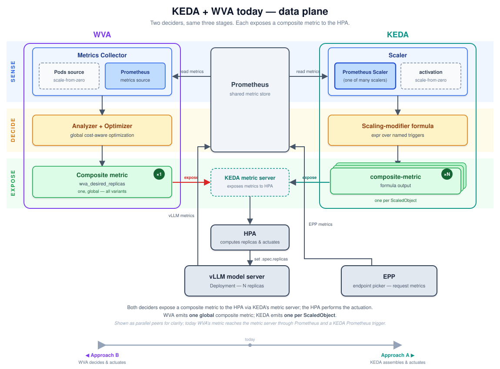

# Refocusing WVA: from all-in-one autoscaler to a global optimizer in a KEDA-native stack

**Status:** Draft · **Audience:** llm-d autoscaling maintainers

## TL;DR

This document answers **two separate questions**, in order. Keeping them separate
is the whole point — the first is a one-time architecture decision for the
project; the second is a per-deployment decision each customer makes.

**Question 1 — How far should WVA's scope go?** (project architecture)

> Make WVA a **metric shop**, not a full autoscaler. WVA produces metrics; KEDA/HPA
> always performs the actuation. WVA's global optimizer is *kept*, but exposed as
> an **optional** top-of-spectrum metric — never as the thing that writes replicas.
> (This is "Approach A", with WVA's optimizer retained; the alternative "Approach
> B" — WVA grows to own actuation — is rejected below.)

**Question 2 — Given that architecture, when does a customer install WVA?**
(per-deployment)

> **If two models both spike, can you just add GPUs — or must they share a pool
> that can't grow?** Elastic capacity (cloud, over-provisioned) → KEDA alone is
> enough, skip WVA. **Fixed** shared pool → install WVA: deciding *who gives up
> GPUs when there aren't enough for everyone* is the one thing KEDA cannot do on
> its own.

The rest of the document develops these in two parts: **Part 1** settles the
architecture (A vs B); **Part 2** — assuming that architecture — defines exactly
when a customer needs the WVA binary.

## Background: KEDA and WVA are the same shape

Today WVA and KEDA run side by side, and — at the level of the data plane — they
are architecturally the same three-stage pipeline: **sense → decide → expose**,
with the Kubernetes HPA performing actuation.

- **Sense.** Both read the same signals. WVA's collector and KEDA's Prometheus
  scaler both pull from Prometheus (fed by vLLM and EPP); both additionally have a
  scale-from-zero path (WVA a Pods source, KEDA activation triggers).
- **Decide.** Both turn those signals into a scaling number. WVA runs a global
  cost-aware optimizer; KEDA runs a configurable formula over its inputs.
- **Expose.** Both hand the HPA a single number to scale on. WVA produces **one
  global** number covering all models; KEDA produces **one per workload**.

The important consequence: WVA and KEDA are doing **the same job twice.** Both
sense, both decide, both hand the HPA a number. That redundancy is what makes the
design question interesting — it is not "WVA **or** KEDA," but **who should own
the decision and the actuation, and what should the other one do instead.**

There are two ways to remove the redundancy, and they are the competing proposals
(the A↔B bar at the bottom of the diagram):

- **Toward KEDA (Approach A):** KEDA owns the decision and the actuation; WVA stops
  deciding and instead just *feeds KEDA better inputs* (metrics). WVA does less.
- **Toward WVA (Approach B):** WVA owns the decision *and takes over actuation too*,
  making KEDA unnecessary. WVA does more.

The question is which direction to collapse the redundancy.

---

# Part 1 — How far should WVA's scope go?

This part is the project-level architecture decision. It does not depend on any
particular customer; it decides what kind of component WVA should be.

## The two competing directions

> **"Fits together" (joint feasibility)** — a phrase used throughout below. Each
> model can be given a replica count that is perfectly right *for that model on its
> own*. But the counts also have to **add up to something the cluster can actually
> run**. If model A is given 7 replicas and model B is given 6, both numbers can be
> individually reasonable — yet if only 10 GPUs exist, 7 + 6 don't fit. One
> component deciding both numbers at once can keep the total within budget; several
> components each deciding their own number can't — they can only hope the totals
> happen to fit.

### Approach A — Metric shop (reduce WVA's scope, push toward KEDA)

KEDA/HPA does the deciding-assembly and all actuation, drawing on metrics from
**several sources** — vLLM (raw serving metrics), EPP (per-model aggregates and
demand), and WVA. Crucially, **WVA becomes just one metric source among these, not
a privileged one.** It contributes only the metrics that neither vLLM nor EPP can
produce — chiefly its global optimizer's allocation — and for many deployments
KEDA never reads a WVA metric at all (vLLM + EPP are enough). In the extreme, WVA
is absent entirely and KEDA assembles the decision from vLLM and EPP alone.

| Pros | Cons |
|---|---|
| Reuses mature, battle-tested KEDA/HPA machinery (scaling, scale-from-zero, smoothing, fallback) — WVA builds none of it | On its own, KEDA can't guarantee models sharing a fixed GPU pool stay within budget (explained below) |
| Small, focused codebase — WVA keeps only what's unique to it (the model + the optimizer) | WVA's smartest capability, cost-optimal packing, can't be expressed in KEDA's formula language, so KEDA alone can't reproduce it |
| Off the critical path — if WVA stops, the last metric stays in Prometheus and KEDA keeps scaling | Ceiling on what's possible is set by what KEDA's formula language can express |
| Composes with the ecosystem — additive, not a replacement | The decision is spread across many independent controllers — harder to reason about under contention |
| The metrics are useful on their own (dashboards, capacity planning) | Moving the performance model into EPP means shipping its benchmark data to every EPP |
| **Fits any environment by dialing scope** — a small cloud cluster uses just the cheap metrics; a large on-prem fleet adds the optimizer. Same building blocks, no all-or-nothing commitment | Consistent behavior across environments depends on KEDA/HPA being present and configured the same way |
| Consistent with the VA-CRD deprecation direction (stop being a mandatory integration point) | |
| Lower adoption friction ("add a metric + a trigger") | |

### Approach B — Full autoscaler (grow WVA's scope, pull toward WVA)

WVA owns the whole loop — sense, decide, **and actuate** — subsuming KEDA.

| Pros | Cons |
|---|---|
| Full control → real guarantees: deciding all models at once and acting directly means the allocation always fits a fixed budget | Rebuilds a large, mature stack (scaling, scale-from-zero, smoothing, all the edge cases) and has to maintain it |
| Its smartest capabilities are fully realized — any optimization policy, no expression-language ceiling | Becomes a mandatory piece in the request-serving path — reverses the direction we set with the VA-CRD deprecation |
| One coherent story for the fixed-pool case — budgeting and priorities enforced in one place | Higher operational risk — a component directly setting replica counts in the hot path |
| Single place to configure and reason about scaling | Fights the ecosystem — competes with KEDA/HPA instead of composing; conflicts if both run |
| Not limited by another project's roadmap | Hard to adopt ("replace your autoscaler"); lots to build before it's on par |
| | **One heavyweight component must fit every environment** — cloud and on-prem, tiny and huge, simple and complex all get the same full autoscaler, whether or not they need it (no way to opt down) |
| | Owns autoscaling for the whole stack indefinitely |

## Decision: Approach A, keeping WVA's optimizer as an optional metric

The pros/cons resolve decisively toward **A** on architecture grounds, independent
of any customer:

- **B reverses a direction we already committed to.** Growing WVA into a
  full autoscaler makes it a mandatory, on-critical-path integration point — the
  exact coupling the VA-CRD deprecation set out to remove. It also reinvents mature
  KEDA/HPA machinery (actuation, scale-from-zero, stabilization, fallback) and
  competes with the incumbent autoscaler instead of composing with it.
- **A keeps WVA off the critical path and small.** WVA emits metrics; if it dies,
  the last value persists and KEDA keeps working. Its surface shrinks to what is
  genuinely differentiated.
- **A fits the full range of llm-d environments; B forces one size on all of
  them.** llm-d autoscaling has to cover a huge span — tiny clusters and large
  fleets, cloud and on-prem, simple single-model setups and complex multi-tenant
  ones. A lets each deployment dial in exactly the scope it needs from shared
  building blocks (cheap metrics only, or all the way up to the optimizer). B
  ships one heavyweight autoscaler that every deployment must run whether it needs
  the sophistication or not — the opposite of flexible.

The one real cost of A — that KEDA's formula language can't reproduce WVA's
cost-optimal packing — is **not** a reason to pick B. It is a reason to
**keep WVA's optimizer** and expose its result as an *optional metric*
(`wva_desired_replicas`) that KEDA passes through. That preserves B's one genuine
advantage (an allocation that always fits the budget) without B's costs, because
actuation still lives in KEDA.

So Approach A does not mean "throw away the optimizer." It means:

> **WVA is a metric shop that offers a spectrum of metrics — from raw load up to a
> fully pre-solved global allocation — and KEDA/HPA always actuates.** The
> optimizer survives as the top of that spectrum, optional and off the critical
> path.

**This settles the architecture. It does not yet say who needs the optimizer** —
that is Part 2. Part 1's output is only: *one stack (KEDA-native), WVA optional,
actuation always in KEDA.*

---

# Part 2 — When does a customer need the WVA binary?

Given the Part 1 architecture, most of the metric spectrum needs no WVA process at
all — vLLM and EPP produce the lower-tier metrics, and KEDA assembles them. The
WVA binary earns its place only at the top of the spectrum. This part pins down
exactly when.

## The decomposition: what needs a WVA process and what doesn't

The scaling decision breaks into three layers, each needing a wider view than the
last. Different components can produce different layers, and KEDA stitches them
together — so a customer only uses as many layers as their situation calls for.

| Layer | In plain terms | What it needs to see | Who can produce it |
|---|---|---|---|
| **L0 — Raw load** | "how busy is each pod right now" (request rate, queue, cache use) | one pod | vLLM / EPP (already emitted) |
| **L1 — Per-model demand** | "how many replicas would this model need to hit its SLO" | one model's load + a performance model | **EPP** (or WVA) |
| **L2 — Coordinated allocation** | "given everyone's needs and a shared GPU budget, how many replicas each model actually gets" | all models at once + the shared budget + priorities + cost | **KEDA** (simple sharing rules) or **WVA** (cost-optimal packing) |

Two findings sharpen where each layer lives (full detail in
[wva-metric-shop.md](./wva-metric-shop.md) and
[wva-vs-keda-decider.md](./wva-vs-keda-decider.md)):

**EPP is the natural home for L1.** From analysis of the
[EPP codebase](https://github.com/llm-d/llm-d-router): EPP already emits L0 and
per-pool aggregates (average KV utilization, queue size, running requests, TTFT /
ITL), carries a roofline saturation model, and exposes a plugin registry. It hosts
one model (all that model's variants), so it can produce per-variant demand for
what it serves. It is missing only the load→replicas mapping — a coherent
extension because that signal *is* scheduling-relevant. (Cost: the benchmarking
performance profiles must reach every EPP.)

**Not all of L2 needs WVA — it depends on how the sharing rule works.**

- **Simple sharing rules → KEDA can do it, no WVA.** Rules like "split the GPUs in
  proportion to each model's demand" or "give higher-priority models their share
  first, then divide the rest" only need a couple of cluster-wide totals (how much
  everyone wants, how much is available). KEDA's formula can compute those and
  hand each model its slice. Because every model runs the *same* rule off the
  *same* totals, the slices are designed to add up.
- **Cost-optimal packing → only WVA can do it.** The interesting rule — "spend the
  fixed GPUs to minimize cost while keeping every model's SLO, choosing the best
  GPU type for each" — can't be reduced to a couple of totals. It requires looking
  at every model at once and trying combinations. KEDA's formula has no way to
  express that; WVA's optimizer is built for it. **This is WVA's irreducible job.**
- **Scope note.** Some coordination is *within* one model (which mix of A100 vs
  H100 for that model) and stays inside a single EPP's view; coordination *across*
  models needs a view no single EPP has. Whether these two ever entangle depends on
  real llm-d cluster layout — an open question we deliberately leave aside here.

### Why the simple sharing rules can still overshoot the budget

You might expect a rule like "split the GPUs in proportion to demand" to be safe —
after all, the shares are designed to add up to the budget. The catch is *who
computes them.* KEDA doesn't decide all the models together; it hands each model
its own independent controller, and each of those wakes up on its own schedule
(about every 15 seconds) and reads the cluster's totals *at a slightly different
moment*. Those moments don't line up (this is verified behavior of the Kubernetes
autoscaler, not a KEDA quirk). So when demand is changing, two controllers can be
working from two different pictures of "how much does everyone want right now" —
and slices computed from different pictures don't necessarily add up.

**A quick picture.** Two models share 10 GPUs, and demand for both jumps at once.
Model A's controller wakes up first — before it can "see" that B has also
surged — so from its point of view there's less total competition and it grabs a
big slice. Model B's controller wakes up a few seconds later, now seeing the full
surge, and takes a more modest slice. Each did the arithmetic correctly for the
picture it had; but because the pictures differed, the two slices together ask for
**more than 10 GPUs.**

**Why that matters when GPUs are fixed.** The extra pods have nowhere to run —
they sit **Pending**. Worse, *which* model ends up short is now decided by
whichever pods happened to get scheduled first, **not** by your priority policy: a
best-effort model that woke up early can be squatting on GPUs your critical model
now needs. It sorts itself out once the controllers catch up to the same picture —
but "once they catch up" can be up to a minute or so of over-asking, plus a longer
tail (up to ~5 minutes) where controllers hold onto their recent peak before
scaling down. If your cluster can just add GPUs, none of this hurts. If your GPU
pool is fixed, the allocation that actually runs is not the one you intended.

**Why WVA doesn't have this problem.** WVA decides all the models *together, from
one picture,* in a single pass — so it simply never hands out more GPUs than
exist. Its picture can be a little stale (it refreshes on an interval, ~60s by
default), but whatever it decides always fits. One decider working from one
snapshot, versus many deciders each working from their own.

## The install-or-not rule

The decomposition and the consistency argument reduce to a single objective test —
the one in the TL;DR:

> **If two models both spike, can you just add GPUs, or must they share a pool that
> can't grow?**

This is objective (a customer knows whether their GPU pool is elastic) and it is
exactly where the layers divide: coordination has something to decide *only* when
demand can exceed capacity. Below that line, per-model scaling is independent and
KEDA assembles it; above it, someone must divide up a scarce shared pool, and only
a single component deciding everything at once can keep the total within budget.

Each customer uses only as much of the metric spectrum as they need — and a WVA
process is required only in the last row:

| Customer situation | What they use | Who assembles the decision | Needs WVA? |
|---|---|---|---|
| Basic per-model scaling | raw load (from vLLM / EPP) | KEDA, from simple thresholds | No |
| SLO-aware, can add GPUs | per-model demand (from EPP) | KEDA, passing the demand through | No |
| Shared pool, OK with brief over-asking | per-model demand + cluster totals | KEDA, applying a simple sharing rule | No |
| **Fixed pool, must never over-ask** | **WVA's ready-made allocation** | KEDA, passing it through | **Yes** |

Only the bottom row needs WVA — and it is exactly the "fixed shared pool" case.
There, WVA's all-at-once decision always fits the budget, whereas the simple
sharing rule one row up can briefly over-ask (the wake-up-timing problem shown
above). The only thing given up is a small lag between WVA deciding and KEDA
acting — still far tighter than many independent controllers drifting apart, and
the price of keeping actuation in KEDA (Part 1).

In terms of the diagram, this uses the whole A↔B bar: WVA offers metrics at every
point from raw load up to a ready-made allocation, the customer's capacity
situation picks where on that bar they sit, and KEDA always does the actuation.

## What this implies (non-goals for this doc)

This document argues the *direction*; it does not specify implementation. Open
items for follow-up design:

- The concrete metric names/labels for the L1 demand signal and how EPP emits them.
- Whether the L1 performance model is owned by EPP, WVA, or both, and how
  benchmarking profiles are distributed.
- The exact `expr` templates for proportional and priority-tiered rationing.
- The llm-d pool-composition/topology question (intra- vs cross-model coupling).
- Migration from today's `wva_desired_replicas`-only surface to the layered set.

## References

- [wva-metric-shop.md](./wva-metric-shop.md) — metric decomposition, EPP findings, packaging, consistency derivation
- [wva-vs-keda-decider.md](./wva-vs-keda-decider.md) — decider expressiveness, side-by-side
- [modeling-optimization.md](./modeling-optimization.md) — WVA modeling & optimization
- [controller-behavior.md](./controller-behavior.md) — WVA reconciliation & intervals
- EPP: <https://github.com/llm-d/llm-d-router>
- KEDA ScaledObject spec: <https://keda.sh/docs/latest/reference/scaledobject-spec/>
- Kubernetes HPA: <https://kubernetes.io/docs/tasks/run-application/horizontal-pod-autoscale/>
