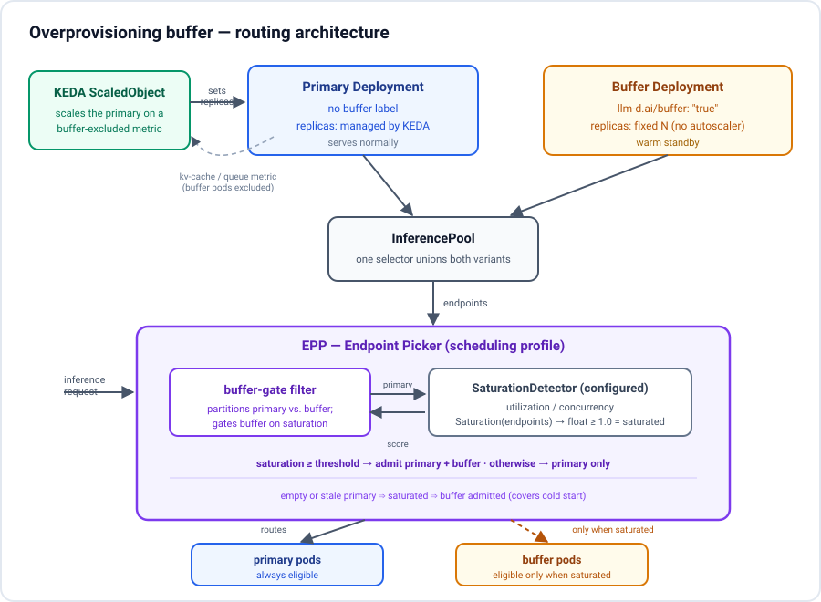

# Overprovisioning buffer via a buffer variant (KEDA)

**Status:** Draft
**Date:** 2026-06-15
**Audience:** WVA contributors, llm-d-router (EPP) contributors

## Problem

Model server cold start is slow (minutes). When demand bursts, KEDA computes
the right replica count quickly, but new pods are not Ready in time — the
burst is served by an undersized fleet and SLOs are missed.

We want `N` extra warm pods on standby. Buffer pods are real, Ready model
servers that receive no traffic until the primary fleet is saturated, at which
point EPP admits them into scheduling instantly — no cold start, no
controller-mediated promotion.

## Goals

- Keep a configurable number of warm buffer pods alongside the primary fleet.
- Hide buffer pods from routing until the primary fleet is saturated; admit
  them via EPP's own per-request scheduling decision (not a label flip).
- Primary scales on its own KEDA metric; buffer stays at `N`.
- No new CRDs. No changes to the deprecated `VariantAutoscaling` CRD.

## Non-goals (v1)

- Cross-model / cross-pool shared buffers.
- Predictive or auto-tuned buffer sizing (admin sets `N`).
- Buffer pods on a different accelerator SKU than primary (same PodSpec in v1).
- Direct HPA support without KEDA.

## Design

Two sibling Deployments in one InferencePool, distinguished by a pod label. A
new EPP scheduling filter gates the buffer sub-fleet on the primary's
saturation.



<details>
<summary>Text version of the diagram</summary>

```
   Primary Deployment              Buffer Deployment
   (no buffer label)               llm-d.ai/buffer: "true"
   replicas: KEDA ScaledObject     replicas: fixed N (no autoscaler)
            \                              /
             \                            /
              +------> InferencePool <---+       selector unions both
                           |
                           v
                          EPP
                    buffer-gate filter  --> reads configured SaturationDetector
```

</details>

- **Primary variant.** Existing Deployment scaled by KEDA. Pods carry no
  buffer label.
- **Buffer variant.** Sibling Deployment, same PodSpec, `spec.replicas=N`, no
  autoscaler. Pods carry `llm-d.ai/buffer: "true"`.
- **InferencePool.** One pool selects both variants (as P/D disaggregation
  already unions sub-fleets under `llm-d.ai/role`).
- **buffer-gate filter.** New scheduling `Filter` that drops buffer endpoints
  unless the primary sub-fleet's saturation is at/above a threshold.

WVA has no runtime role: the operator authors the Deployments, ScaledObject,
InferencePool, and EPP config declaratively. Nothing to reconcile.

### Label choice

WVA already uses `llm-d.ai/variant` for a different purpose (value = the
`VariantAutoscaling` name, consumed by the metrics collector —
`internal/constants/labels.go`). To avoid a collision, buffering uses a
dedicated key: `llm-d.ai/buffer: "true"` on buffer pods, absent on primary.

## EPP integration (the load-bearing component)

A new `Filter` plugin at
`pkg/epp/framework/plugins/scheduling/filter/buffergate/` (sibling of
`bylabel/`), registered in `cmd/epp/runner/runner.go`.

The filter partitions candidates into primary/buffer by label, then reuses the
**already-configured** `SaturationDetector`. That interface
(`pkg/epp/framework/interface/flowcontrol`) exposes a saturation gradient over
a caller-supplied endpoint slice:

```go
Saturation(ctx context.Context, endpoints []datalayer.Endpoint) float64
// >= 1.0 means fully saturated
```

so the gate passes only the primary sub-fleet and thresholds the result. No
interface change and no duplicated saturation math are needed — the filter
resolves the detector by name through the plugin `Handle`
(`handle.Plugin(ref)`), the same mechanism the disagg profile handler uses.

```go
func (f *BufferGate) Filter(ctx context.Context, _ *scheduling.InferenceRequest,
    endpoints []scheduling.Endpoint) []scheduling.Endpoint {

    primary, buffer := partitionByBufferLabel(endpoints) // GetMetadata().Labels
    if len(buffer) == 0 {
        return primary // nothing to gate
    }
    // Empty or stale primary => Saturation returns >= 1.0 (covers cold start).
    if f.detector.Saturation(ctx, toDatalayer(primary)) >= f.saturationThreshold {
        return endpoints // admit primary + buffer
    }
    return primary
}
```

`saturationThreshold` defaults to `1.0` ("primary fully saturated"); operators
can lower it to admit buffer slightly earlier. If `detectorRef` is
unresolvable the factory errors, so misconfiguration is caught at startup.

**Why not reuse the utilization detector's own `Filter`?** It already drops
*individual* saturated endpoints, but that is endpoint-local backpressure — it
cannot express "keep the buffer sub-fleet invisible until the *primary*
sub-fleet as a whole saturates." The gate is a set-level decision across two
sub-fleets; it borrows the detector for the number, not the policy.

## Metric dilution

The primary's KEDA trigger must exclude buffer pods, or buffer pods (serving
nothing) drag the metric down and KEDA under-scales. Recommended: filter the
PromQL by the sanitized label (`llm-d.ai/buffer` → `llm_d_ai_buffer`):

```
avg(vllm:kv_cache_usage{model="foo", llm_d_ai_buffer=""})
```

Backup when scrape pipelines strip pod labels: a separate `PodMonitor` per
variant so KEDA reads only the primary stream.

## Failure modes

| Failure | Behavior |
|---|---|
| Buffer Deployment deleted | Feature off; primary carries all traffic. |
| Primary Deployment deleted | `Saturation([]) >= threshold` → buffer serves all traffic. Intended fallback. |
| EPP filter not enabled | Buffer endpoints serve normally — safe, but not warm-standby. |
| `detectorRef` unresolvable | Factory errors; EPP fails to start with a clear message. |
| Primary metrics stale/nil | Detector scores them saturated → buffer admitted. Conservative. |
| Trigger PromQL includes buffer pods | KEDA under-scales; see Metric dilution. |
| Buffer pod dies | Deployment controller replaces it. No controller involvement. |

## Example config

```yaml
# Buffer Deployment — same PodSpec as primary, fixed replicas, no autoscaler
apiVersion: apps/v1
kind: Deployment
metadata:
  name: foo-buffer
  labels: {model: foo, llm-d.ai/buffer: "true"}
spec:
  replicas: 2
  selector:
    matchLabels: {model: foo, app: foo-buffer}
  template:
    metadata:
      labels: {model: foo, app: foo-buffer, llm-d.ai/buffer: "true"}
    spec: {containers: [...]}    # identical to primary
---
apiVersion: keda.sh/v1alpha1
kind: ScaledObject
metadata: {name: foo-primary}
spec:
  scaleTargetRef: {name: foo-primary}
  minReplicaCount: 1
  maxReplicaCount: 20
  triggers:
  - type: prometheus
    metadata:
      serverAddress: http://prometheus:9090
      query: 'avg(vllm:kv_cache_usage{model="foo", llm_d_ai_buffer=""})'
      threshold: "0.7"
---
apiVersion: inference.networking.k8s.io/v1
kind: InferencePool
metadata: {name: foo}
spec:
  selector:
    matchLabels: {model: foo}    # matches primary AND buffer
  targetPorts:
  - number: 8000
  endpointPickerRef: {name: foo-epp}
---
apiVersion: llm-d.ai/v1alpha1
kind: EndpointPickerConfig
metadata: {name: foo-epp-config}
plugins:
- type: utilization-detector
- type: buffer-gate-filter
  parameters: {detectorRef: utilization-detector, saturationThreshold: 1.0}
- type: max-score-picker
- type: prefix-cache-scorer
flowControl:
  saturationDetector: {pluginRef: utilization-detector}
schedulingProfiles:
- name: default
  plugins:
  - pluginRef: buffer-gate-filter
  - pluginRef: max-score-picker
  - pluginRef: prefix-cache-scorer
    weight: 2
```

## Testing

- **Unit (llm-d-router):** `buffer-gate-filter` over `scheduling.Endpoint`
  fakes with a fake detector — primary saturated → admits buffer; not
  saturated → drops buffer; empty primary → admits; empty buffer → no-op.
  Factory resolves/validates `detectorRef` and defaults `saturationThreshold`.
- **E2E (Make target):** buffer idle while primary serves; drive saturation
  and verify traffic shifts to buffer within one metrics-refresh interval;
  kill a buffer pod and confirm replacement; scale primary via KEDA and
  confirm buffer stays at `N`.

## Rollout

- No buffer Deployment → no buffer endpoints → filter is a no-op. Existing
  deployments are unaffected.
- Enable: author the buffer Deployment, scope the trigger PromQL to exclude
  buffer pods, add `buffer-gate-filter` (+ a `saturationDetector`) to the EPP
  config, restart EPP.
- Disable: delete the buffer Deployment.
